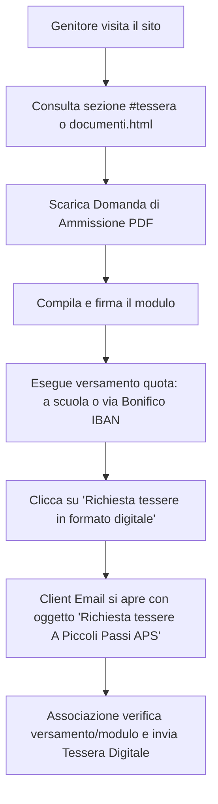
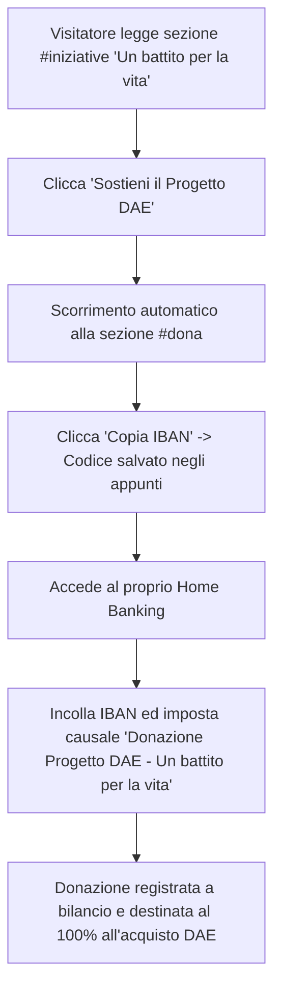

# Business Blueprint Funzionale (BBP-F)
## Portale Web Istituzionale – A Piccoli Passi APS

---

### Document Information
- **Denominazione Ente:** A Piccoli Passi Associazione di Promozione Sociale (A.P.S.)
- **Codice Fiscale:** 92105570391
- **Tipologia Ente:** Ente del Terzo Settore (ETS) iscritto al RUNTS ai sensi del D.Lgs. 3 luglio 2017 n. 117
- **Sede Legale e Operativa:** Via Gambellara n. 7, 48125 San Pietro in Vincoli (RA)
- **Scuola di Riferimento:** Polo Paritario d'Infanzia "Madre Teresa di Calcutta"
- **Versione Documento:** 1.2 (Consolidata)
- **Data di Rilascio:** Settembre 2026
- **Stato del Progetto:** In Produzione su GitHub Pages

---

## 1. Executive Summary & Finalità del Progetto

Il presente documento definisce le specifiche funzionali del portale web istituzionale di **A Piccoli Passi APS**, associazione di genitori nata per affiancare, supportare e valorizzare le attività educative, ludiche e didattiche del Polo d'Infanzia "Madre Teresa di Calcutta" di San Pietro in Vincoli (Ravenna).

Il portale nasce con tre macro-obiettivi strategici:
1. **Trasparenza Amministrativa e Istituzionale:** Fornire uno spazio pubblico ufficiale in cui soci, famiglie e organi di vigilanza (RUNTS, Agenzia delle Entrate) possano verificare lo Statuto, i dati fiscali, le modalità di rendicontazione e la gratuità delle cariche associative.
2. **Promozione della Partecipazione e del Tesseramento:** Favorire l'adesione della comunità scolastica e del territorio attraverso la campagna tesseramento annuale, la digitalizzazione della richiesta tessere e la valorizzazione dei vantaggi per le famiglie associate.
3. **Raccolta Fondi e Finanziamento Iniziative per l'Infanzia:** Canalizzare donazioni liberali e promuovere progetti specifici ad alto impatto sociale, primo fra tutti la cardioprotezione della scuola attraverso l'acquisto di un defibrillatore semiautomatico (DAE) e la formazione BLSD per le maestre.

---

## 2. Inquadramento Istituzionale & Stakeholder

### 2.1 Governance e Identità Giuridica
- **Natura Giuridica:** Associazione di Promozione Sociale (APS) non commerciale, apartitica, apolitica e senza scopo di lucro.
- **Divieto di Utili:** Vige il divieto assoluto di distribuzione, anche indiretta, di utili o avanzi di gestione (Art. 26 Statuto).
- **Gratuità delle Cariche:** Tutti i membri del Consiglio Direttivo e gli organi sociali operano a titolo completamente volontario e gratuito (Art. 27 Statuto).
- **Legale Rappresentante:** Glenda Sternini (Presidente in carica).

### 2.2 Mappa degli Stakeholder e Personas

| Categoria | Descrizione | Bisogni Primari sul Portale |
|---|---|---|
| **Genitori Frequentanti** | Madri e padri con bambini iscritti al nido o alla scuola d'infanzia. | Scaricare la modulistica, tesserarsi, conoscere le feste/laboratori, fruire delle agevolazioni. |
| **Nuovi Genitori** | Famiglie del territorio di San Pietro in Vincoli in fase di orientamento. | Conoscere l'identità della scuola, i valori educativi e le finalità della comunità dei genitori. |
| **Soci Ordinari** | Genitori e sostenitori regolarmente iscritti per l'anno associativo. | Esercitare i diritti statutari (assemblee, voto, esame dei libri sociali ex Art. 10). |
| **Donatori e Sostenitori** | Privati cittadini, nonni, commercianti e imprese locali. | Reperire le coordinate bancarie ufficiali (IBAN) e conoscere le causali per sostenere progetti mirati. |
| **Personale Docente** | Educatrici e maestre del Polo "Madre Teresa di Calcutta". | Condividere priorità educative, attrezzature didattiche e beneficiare di corsi di sicurezza (BLSD). |
| **Organi di Vigilanza** | RUNTS, Agenzia delle Entrate, revisori. | Consultare Statuto registrato, codice fiscale, assenza fini di lucro e trasparenza legale. |

---

## 3. Mappa del Sito e Architettura delle Informazioni

L'architettura informativa è organizzata per garantire la massima linearità di navigazione (*single-page app* narrativa per i contenuti istituzionali e pagine dedicate per la documentazione tecnica e legale):

```
├── index.html (Homepage Narrativa e Istituzionale)
│   ├── #chi-siamo (Hero Banner, Mission e Identità Comunitaria)
│   ├── #finalita (Le 7 Finalità Statutarie dell'Associazione)
│   ├── #tessera (Campagna Tesseramento 2026/2027 & Vantaggio Extra)
│   ├── #iniziative (Iniziativa Straordinaria: Defibrillatore DAE e Corsi BLSD)
│   ├── #dona (Sostegno Economico: Bonifico Bancario, IBAN e Trasparenza)
│   ├── #faq (Domande Frequenti con Fisarmonica Accessibile)
│   ├── #contatti (Recapiti Telefonici, WhatsApp, Email, Orari e Indirizzo)
│   └── #unisciti (Invito all'Azione e Chiusura Comunitaria)
│
├── documenti.html (Centro Documenti e Trasparenza)
│   ├── Sezione Card Interattive (Statuto, Domanda Ammissione, Liberatoria Minori, Verbali)
│   └── #statuto-online (Testo Integrale dello Statuto costitutivo ETS)
│
├── privacy.html (Informativa Privacy e Protezione Dati GDPR)
└── 404.html (Pagina di Errore Personalizzata e Recupero Navigazione)
```

---

## 4. Requisiti Funzionali di Dettaglio (RF)

### RF01: Navigazione Principale e Menu Mobile
- **Barra Desktop:** Visibile stabilmente con logo circolare, denominazione associativa e 8 collegamenti ad ancora (`#chi-siamo`, `#finalita`, `#tessera`, `#iniziative`, `#dona`, `documenti.html`, `#faq`, `#contatti`) oltre al pulsante CTA *"Unisciti a noi!"*.
- **Menu Hamburger Mobile:** Su dispositivi compatti (<900px), la barra collassa in un pulsante hamburger touch-friendly ($\ge 44\times44\text{px}$). Al tocco si apre una tendina fluida con le medesime voci disposte verticalmente.
- **Interazione Intelligente:** Il menu si richiude automaticamente al tocco di un'ancora interna, al tocco all'esterno della barra o premendo il tasto <kbd>Escape</kbd>.

### RF02: Sezione "Chi Siamo" (Hero Section)
- **Visual Identity:** Medaglione centrale con l'illustrazione del Polo d'Infanzia "Madre Teresa di Calcutta", logo con "A" maiuscola corsiva (stile firma/bambino) in arancione caldo e dicitura formale ETS.
- **Claim:** *"Piccoli passi oggi, grandi persone domani."*
- **Call to Action Principali:** Due pulsanti ad alto contrasto per l'accesso immediato:
  - Pulsante primario: *"Diventa Socio 2026/27"* (ancora a `#tessera`).
  - Pulsante secondario: *"Scopri le 7 Finalità"* (ancora a `#finalita`).
- **Elementi Grafici Accessori:** Elementi decorativi a tema impronte di bambino e palette naturale (verde bosco, verde foglia, arancione calendola, azzurro cielo).

### RF03: Le 7 Finalità Statutarie
Esposizione semantica strutturata in griglia a tessere delle 7 aree operative dell'Associazione:
1. **Dialogo e Collaborazione Scuola-Famiglia:** Creazione di un ponte costante tra educatrici e genitori.
2. **Supporto Materiale e Sussidi Didattici:** Finanziamento per l'acquisto di libri, giochi in legno, arredi montessoriani e materiali per l'atelier.
3. **Manutenzione e Cura degli Spazi Educativi:** Valorizzazione degli ambienti interni e del grande giardino scolastico.
4. **Organizzazione Eventi e Feste Comunitarie:** Promozione di momenti conviviali (Festa d'Autunno, Natale, Carnevale, Festa di Fine Anno).
5. **Laboratori e Formazione per Famiglie:** Incontri pedagogici e workshop per il supporto alla genitorialità.
6. **Inclusione e Pari Opportunità:** Fondo di solidarietà per garantire a ogni bambino la piena partecipazione a gite e attività.
7. **Rappresentanza e Rete Civica Territoriale:** Dialogo con il Comune di Ravenna, la parrocchia e le realtà del Terzo Settore di San Pietro in Vincoli.

### RF04: Tesseramento Annuale 2026/2027
- **Periodo di Validità Statutaria (Art. 8 Statuto):** Esplicitamente indicato: *1° Settembre 2026 – 31 Agosto 2027* (coincidente con l'anno scolastico).
- **Quote Associative Ufficiali:**
  - Quota dichiarante / socio principale: **€ 15,00**.
  - Quota agevolata per familiari conviventi: **€ 10,00** (valida fino al 01/10/2026; successivamente € 15,00 per ciascun membro).
- **Vantaggio Extra in Evidenza:** Box dedicato con evidenziazione dorata per il beneficio riservato ai nuclei familiari con più tessere:
  > *"Vantaggio extra: Per ogni bambino con almeno due familiari tesserati, ci sarà uno sconto del 10% sui calendari e sui prodotti natalizi della scuola!"*
- **Azione Richiesta Tessera Digitale:** Pulsante email preconfigurato:
  - Destinatario: `apiccolipassi.spiv@gmail.com`
  - Oggetto preimpostato: `Richiesta tessere A Piccoli Passi APS`
- **Nota di Trasparenza sul Rilascio:** Callout visivo obbligatorio:
  > *"Nota: Il rilascio della tessera digitale è gratuito ma subordinato alla compilazione del modulo e al versamento della quota associativa."*

### RF05: Iniziativa Straordinaria – Progetto DAE "Un battito per la vita"
- **Obiettivo Sociale:** Raccogliere fondi per dotare la scuola di un Defibrillatore Semiautomatico Esterno (DAE) di ultima generazione e finanziare i corsi di formazione e abilitazione BLSD (Basic Life Support and Defibrillation) per l'intero corpo docente.
- **Struttura a Due Colonne:**
  - *Colonna Narrativa:* Testo emozionale che richiama il valore insostituibile della sicurezza dei più piccoli e la prontezza d'intervento delle maestre.
  - *Colonna Iconografica:* Fotografia reale dell'apparecchio DAE (`DAE.webp` / `DAE.jpeg`) con badge di garanzia *"❤️ Obiettivo: Scuola Cardioprotetta"*.
- **Pulsanti di Azione:** *"❤️ Sostieni il Progetto DAE"* (salto diretto alla sezione Bonifico) e *"Chiedi Informazioni"* (salto a Contatti).

### RF06: Sezione Donazioni & Coordinate Bancarie Ufficiali
- **Istituto Bancario:** *CREDITO COOPERATIVO RAVENNATE, FORLIVESE E IMOLESE SOCIETA' COOPERATIVA* – Filiale di San Pietro in Vincoli.
- **Intestatario Ufficiale:** *A PICCOLI PASSI APS*.
- **Codice IBAN:** `IT49 R085 4213 1080 0000 0775 115`.
- **Copia Rapida Interattiva:** Tasto "Copia IBAN" con copia automatica negli appunti di sistema e riscontro visivo temporizzato (*"Copiato! ✓"* per 2,5 secondi).
- **Causali Bancarie Codificate:**
  1. *Per sostenere il Defibrillatore:* `"Donazione Progetto DAE - Un battito per la vita"`
  2. *Per sostenere i progetti educativi:* `"Donazione liberale per progetti Polo Madre Teresa di Calcutta"`
  3. *Per il tesseramento annuale:* `"Quota associativa 2026/2027 - [Nome e Cognome Socio]"`
- **Riferimento Trasparenza ETS:** Richiamo esplicito agli Artt. 26 e 27 dello Statuto che vietano la distribuzione di utili e stabiliscono la totale gratuità delle cariche associative.

### RF07: Domande Frequenti (FAQ)
Componente nativo a fisarmonica semantica (`<details>` e `<summary>`) per fornire risposte chiare senza appesantire la lettura:
1. *Cos'è l'associazione e qual è il suo legame con la scuola?*
2. *Chi può diventare socio e quali sono i diritti?*
3. *Quali sono i dati fiscali dell'Associazione (Codice Fiscale)?*
4. *Come vengono spesi i fondi raccolti e dove consultare i bilanci?*

### RF08: Recapiti e Contatti Diretti
- **Presidente / Referente:** Glenda Sternini – Telefono diretto e link WhatsApp immediato (`https://wa.me/393347019793`).
- **Referente Direttivo:** Andrea Fantini – Telefono diretto (`+39 340 793 1502`).
- **Email Istituzionale:** `apiccolipassi.spiv@gmail.com`.
- **Instagram Ufficiale:** `@apiccolipassi.spiv`.
- **Sede Fisica e Mappa:** Indicazione puntuale di Via Gambellara 7, San Pietro in Vincoli (RA).

### RF09: Centro Documenti Ufficiali (`documenti.html`)
Spazio pubblico dedicato alla trasparenza dell'ente, strutturato con **schede uniformi e speculari** dotate di doppio pulsante:
- **Pulsante Sinistro:** 🖨️ *"Stampa Modulo"* / *"Stampa Statuto"* collegato alla funzione di stampa nativa del browser `window.print()`.
- **Pulsante Destro:** 📥 *"Scarica in PDF"* con download diretto dei file ufficiali conservati nella directory `Documenti/`:
  1. *Statuto dell'Associazione:* `Documenti/Statuto A PICCOLI PASSI APS.pdf` (+ lettura integrale in pagina).
  2. *Domanda di Ammissione a Socio:* `Documenti/Domanda socio dichiarante 20262027.pdf`.
  3. *Liberatoria Foto e Video Minori:* `Documenti/liberatoria generica minori.pdf` (con la garanzia statutaria di pubblicazione esclusivamente a volto coperto o non riconoscibile).
  4. *Verbali e Rendiconti:* Scheda informativa di trasparenza ai sensi dell'Art. 10 Statuto.

### RF10: Informativa Privacy & Tutela Minori (`privacy.html`)
- **Titolare del Trattamento:** A Piccoli Passi APS, C.F. 92105570391, nella persona del Presidente pro tempore.
- **Conformità GDPR:** Regolamento UE 2016/679.
- **Principio Zero Tracciamento:** Assoluta assenza di cookie di terze parti, profilazione, strumenti analitici invasivi o condivisione di dati all'esterno.
- **Norma Rinforzata Minori:** Trattamento delle immagini fotografiche unicamente previo consenso espresso e vincolato all'offuscamento facciale.

### RF11: Pagina di Errore 404 (`404.html`)
- Messaggio cordiale e illustrato (*"Fuori dal sentiero!"*), con grafica coerente e pulsante immediato *"Torna alla Home"* per eliminare ogni possibilità di vicolo cieco per l'utente.

---

## 5. Flussi Operativi Utente (User Journeys)

### 5.1 Flusso: Richiesta di Tesseramento e Tessera Digitale


### 5.2 Flusso: Donazione per il Progetto Defibrillatore DAE


---

## 6. Matrice di Tracciabilità dei Requisiti (RTM)

| ID Requisito | Descrizione Funzionale | Componente Implementativa | Stato |
|---|---|---|---|
| **RF-01** | Navigazione desktop e mobile hamburger | `<nav class="main-nav">`, `js/menu.js` | Conforme |
| **RF-02** | Hero section con logo e claim istituzionale | `<section class="hero-section">` | Conforme |
| **RF-03** | Schede tematiche 7 Finalità Statutarie | `.grid-finalita-7` in `index.html` | Conforme |
| **RF-04** | Sezione Tesseramento con Vantaggio Extra e mailto | `.tessera-section`, `.tessera-extra-box` | Conforme |
| **RF-05** | Sezione Iniziativa Defibrillatore DAE a 2 colonne | `.iniziative-section`, `images/DAE.webp` | Conforme |
| **RF-06** | Coordinate bancarie IBAN con funzione Copia IBAN | `#ibanText`, `copiaIBAN()` in `index.html` | Conforme |
| **RF-07** | FAQ con fisarmonica accessibile | `.faq-section`, `<details>` nativi | Conforme |
| **RF-08** | Box contatti telefonici, WhatsApp ed email | `.contacts-section` | Conforme |
| **RF-09** | Card documenti speculari con Stampa e Download PDF | `.doc-card`, `.doc-actions` in `documenti.html` | Conforme |
| **RF-10** | Statuto costitutivo ETS integrale leggibile e stampabile | `#statuto-online`, `@media print` | Conforme |
| **RF-11** | Privacy Policy GDPR e tutela rafforzata minori | `privacy.html` | Conforme |
| **RF-12** | Gestione errore 404 personalizzata | `404.html` | Conforme |
