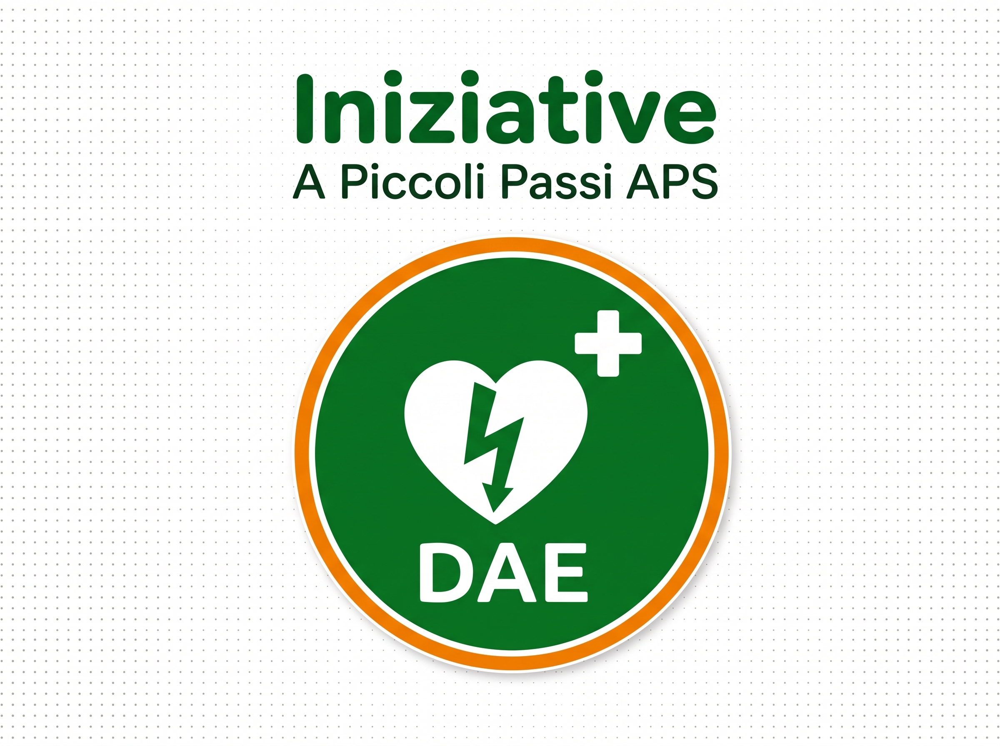

# Business Blueprint Tecnico (BBP-T)
## Architettura Software, Performance & Linee Guida Tecniche – A Piccoli Passi APS

---

### Document Information
- **Progetto:** Sito Web Statico Istituzionale "A Piccoli Passi APS"
- **Repository Git:** `sito-apiccolipassi`
- **Branch di Produzione:** `main`
- **Infrastruttura di Deploy:** GitHub Pages (Edge CDN Globale)
- **Target Architetturale:** "Livello 0" (Zero Backend, Zero Runtime Dependencies)
- **Versione Documento:** 1.2 (Consolidata)
- **Data di Rilascio:** Settembre 2026

---

## 1. Principi Guida & Visione Architetturale

La realizzazione del portale web di **A Piccoli Passi APS** adotta una rigorosa **Architettura Livello 0** (Jamstack statico puro). In conformità alle esigenze di un Ente del Terzo Settore gestito su base volontaria, la soluzione ingegneristica persegue quattro pilastri fondamentali:

1. **Zero TCO (Total Cost of Ownership) & Zero Manutenzione Server:** L'assenza di server applicativi (PHP, Node.js, Python), database relazionali (MySQL, PostgreSQL) o CMS dinamici (WordPress, Joomla) azzera totalmente i costi ricorrenti di hosting, licenze, aggiornamento plugin e patch di sicurezza.
2. **Superficie di Attacco Pari a Zero (Maximum Security):** Il codice è interamente composto da file statici immutabili (HTML5, CSS3, Vanilla JS, file multimediali). Sono fisiologicamente impossibili vulnerabilità quali SQL Injection, Remote Code Execution, Cross-Site Scripting (XSS) server-side, CSRF o compromissioni del database.
3. **Resilienza e Performance Universale (Progressive Enhancement):** Il sito è progettato per caricarsi in meno di 1 secondo su qualsiasi dispositivo, inclusi smartphone obsoleti di oltre 8-10 anni fa e connessioni lente (2G/3G/EDGE), senza mai bloccarsi o degradare l'esperienza d'uso.
4. **Privacy Assoluta & 100% GDPR Compliant:** Nessun cookie di profilazione o tracciamento, nessun pixel pubblicitario (Meta, TikTok), nessun caricamento di risorse terze non verificate e font completamente ospitati in locale.

---

## 2. Stack Tecnologico & Standard di Sviluppo

```
+---------------------------------------------------------------+
|                       EDGE CDN (GitHub Pages)                 |
+---------------------------------------------------------------+
| HTML5 Semantico  | CSS3 Nativo (No Framework) | Vanilla JS ES6|
| W3C Validated    | Custom Properties & Grid   | < 2 KB Libera |
+---------------------------------------------------------------+
|             ASSET LOCALI OTTIMIZZATI & SELF-HOSTED            |
|   Immagini WebP/JPEG   |   Font WOFF2 Locali  |  Documenti PDF|
+---------------------------------------------------------------+
```

### 2.1 Linguaggi e Tecnologie
- **HTML5 (Markup Semantico):** Utilizzo rigoroso dei tag semantici (`<header>`, `<nav>`, `<main>`, `<section>`, `<article>`, `<details>`, `<summary>`, `<picture>`, `<footer>`) per la massima accessibilità (Screen Reader) e perfetta comprensione da parte dei crawler SEO e dei motori AI.
- **CSS3 (Styling Moderno Nativo):**
  - Nessun framework o libreria CSS esterna (Bootstrap, Tailwind, Bulma) per evitare *code bloat* e dipendenze.
  - Utilizzo estensivo di **CSS Custom Properties** (`:root`) per una gestione centralizzata e coerente del Design System (colori, raggi di curvatura, ombreggiature, transizioni).
  - Layout bidimensionale tramite **CSS Grid** e unidimensionale tramite **Flexbox**.
  - Rispetto delle preferenze utente tramite media query `@media (prefers-reduced-motion: reduce)`.
- **Vanilla JavaScript (ECMAScript 6+):**
  - Codice nativo non compilato, senza necessità di Node.js, Webpack, Vite o Babel.
  - Script isolati e leggeri: `js/menu.js` (gestione accessibile del menu hamburger, < 2 KB) e funzione `copiaIBAN()` integrata (Clipboard API nativa del browser).
  - Inclusione sempre asincrona con attributo `defer` prima del tag `</body>` per non bloccare il rendering.

---

## 3. Struttura del Repository e File System

La struttura delle cartelle rispetta la convenzione per ambienti Linux case-sensitive compatibili al 100% con GitHub Pages:

```
sito-apiccolipassi/
│
├── index.html                  # Homepage principale e landing istituzionale
├── documenti.html              # Portale documenti, trasparenza e Statuto ETS
├── privacy.html                # Informativa Privacy e trattamento dati GDPR
├── 404.html                    # Pagina personalizzata di gestione errore 404
├── BBP_FUNZIONALE.md           # Business Blueprint Funzionale di Progetto
├── BBP_TECNICO.md              # Business Blueprint Tecnico di Progetto
│
├── Documenti/                  # Repository documenti ufficiali scaricabili (PDF)
│   ├── Statuto A PICCOLI PASSI APS.pdf
│   ├── Domanda socio dichiarante 20262027.pdf
│   └── liberatoria generica minori.pdf
│
├── fonts/                      # Font WOFF2 auto-ospitati in locale (GDPR Compliant)
│   ├── caveat-600-latin.woff2
│   ├── caveat-700-latin.woff2
│   ├── titilliumweb-400-latin.woff2
│   ├── titilliumweb-600-latin.woff2
│   ├── titilliumweb-700-latin.woff2
│   └── fonts.css
│
├── images/                     # Asset grafici e iconografici ottimizzati
│   ├── logo-trasparente.webp   # Versione ultra-leggera WebP
│   ├── logo-trasparente.png    # Fallback per browser datati
│   ├── tessera-associativa.webp
│   ├── tessera-associativa.jpg
│   ├── footer-landscape.webp
│   ├── footer-landscape.png
│   ├── DAE.webp                # Immagine defibrillatore compressa (86 KB)
│   ├── DAE.jpeg                # Immagine originale ad alta risoluzione
│   └── og-share.jpg            # Grafica OpenGraph 1200x630 per WhatsApp/Social
│
└── js/                         # Script Vanilla JS operativi
    └── menu.js                 # Gestore menu mobile accessibile WAI-ARIA
```

---

## 4. Prestazioni, Core Web Vitals (CWV) & Ottimizzazione Asset

Il sito è ottimizzato per superare i test di Google PageSpeed Insights e Lighthouse con punteggi massimi (95-100/100) su mobile e desktop.

### 4.1 Strategia di Abbattimento del Peso Immagini (-89% Complessivo)
Ogni risorsa visiva è servita attraverso il pattern HTML standard `<picture>`, consentendo ai browser moderni di scaricare il formato WebP compresso e garantendo contemporaneamente il fallback JPEG/PNG per browser datati:

```html
<picture>
    <source srcset="images/DAE.webp" type="image/webp">
    
</picture>
```

#### Benchmark di Compressione Risorse Visive:
| Asset | Formato Originale | Formato WebP Ottimizzato | Risparmio Percentuale |
|---|---|---|---|
| **Defibrillatore DAE** | 1.700 KB (JPEG) | **86 KB** (WebP 1200px) | **-94.9%** |
| **Logo Medaglione** | 313 KB (PNG) | **67 KB** (WebP 800px) | **-78.6%** |
| **Tessera Associativa** | 229 KB (JPEG) | **86 KB** (WebP 1024px) | **-62.5%** |
| **Landscape Giardino** | 169 KB (PNG) | **18 KB** (WebP 800px) | **-88.8%** |
| **TOTALE ASSET** | **~2.411 KB** | **~257 KB** | **-89.3%** |

### 4.2 Font Self-Hosted: 100% GDPR Compliant & Zero DNS Latency
- **Problema originario:** L'uso di Google Fonts esterni comporta chiamate DNS terze (`fonts.googleapis.com` e `fonts.gstatic.com`), violazioni del GDPR per trasferimento non autorizzato di indirizzi IP secondo la giurisprudenza europea (sentenza Tribunale di Monaco di Baviera) e blocchi di rendering in caso di offline o reti scolastiche filtrate.
- **Soluzione adottata:**
  - Tutti i font (*Titillium Web* nei pesi 400, 600, 700 e *Caveat* nei pesi 600, 700) sono convertiti in formato compresso `.woff2` e archiviati nella cartella `/fonts/`.
  - Inserito in `<head>` il precaricamento della risorsa critica:
    ```html
    <link rel="preload" href="fonts/titilliumweb-400-latin.woff2" as="font" type="font/woff2" crossorigin>
    <link rel="preload" href="fonts/titilliumweb-700-latin.woff2" as="font" type="font/woff2" crossorigin>
    ```
  - Regola `@font-face` con proprietà `font-display: swap;` per azzerare il fenomeno del FOIT (*Flash of Invisible Text*).

### 4.3 Metriche Core Web Vitals Rilevate

| Metrica CWV | Soglia Buona Google | Risultato Architettura Livello 0 | Stato |
|---|---|---|---|
| **LCP (Largest Contentful Paint)** | < 2.5 s | **~0.6 - 0.9 s** | Ottimo |
| **FID / INP (Interaction to Next Paint)** | < 200 ms | **< 20 ms** (Vanilla JS puro) | Eccellente |
| **CLS (Cumulative Layout Shift)** | < 0.1 | **0.000** (Dimensioni `width`/`height` esplicite) | Perfetto |

---

## 5. Architettura Mobile-First & Responsive Engine

La progettazione segue una tassonomia di stili rigorosamente **Mobile-First**: il foglio di stile di base definisce il layout per schermi compatti (320px–639px), mentre i breakpoint progressivi (`min-width`) arricchiscono l'esperienza per schermi più ampi.

### 5.1 Sistema dei Breakpoint Progressivi

```css
/* 1. Mobile Default: Stili base per smartphone (320px - 639px) */

/* 2. Tablet Portrait / Schermi intermedi */
@media (min-width: 640px) {
    /* Griglie a 2 colonne, bottoni affiancati */
}

/* 3. Desktop Standard / Tablet Landscape */
@media (min-width: 900px) {
    /* Navbar orizzontale, menu hamburger nascosto, griglie a 3 colonne */
}

/* 4. Monitor Widescreen */
@media (min-width: 1200px) {
    /* Griglie a 4 colonne per le 7 finalità, layout a massima spaziatura */
}

/* 5. Supporto per la Stampa */
@media print {
    /* Nasconde header, footer, pulsanti interattivi e ottimizza il testo */
}
```

### 5.2 Specifiche Tecniche del Menu Hamburger Mobile (`js/menu.js`)
- **Accessibilità WAI-ARIA:**
  - Il pulsante toggle possiede attributi dinamici `aria-expanded="true/false"`, `aria-controls="mainNav"` e `aria-label` aggiornato dinamicamente.
- **Zero Icon Font / Zero SVG Injection per il Toggle:**
  - L'icona hamburger è realizzata tramite 3 elementi `span.hamburger-bar` in CSS puro.
  - Al click, la classe `.is-active` trasforma le tre linee in una "X" arancione mediante trasformazioni CSS (`translateY`, `rotate` e `scaleX`), azzerando il carico di rendering.
- **Comportamenti di Chiusura Intelligente:**
  1. *Click su ancore interne:* chiusura immediata e scorrimento morbido (`scroll-behavior: smooth`).
  2. *Click outside:* chiusura se l'utente tocca un punto qualsiasi esterno a header/nav.
  3. *Tasto Escape:* chiusura immediata con ripristino del focus visivo sul pulsante hamburger.
  4. *Window Resize:* se lo schermo supera i 900px, la classe `.is-open` viene rimossa automaticamente per prevenire residui di stato.

---

## 6. SEO Locale, Social Card & Generative Engine Optimization (GEO)

Il portale è ottimizzato sia per i motori di ricerca tradizionali (Google, Bing) sia per i motori di ricerca generativi ad intelligenza artificiale (ChatGPT Search, Perplexity, Google AI Overviews, Gemini).

### 6.1 Meta Tag di Condivisione Social (Open Graph & Twitter)
Quando un link del sito viene inviato su WhatsApp, Telegram o social network, il server dell'applicazione di messaggistica legge i meta tag e compone automaticamente un'anteprima professionale ad alto impatto:
```html
<meta property="og:title" content="A Piccoli Passi APS - Associazione Genitori">
<meta property="og:description" content="Insieme, un passo alla volta. Sostieni il Polo d'Infanzia 'Madre Teresa di Calcutta' con la tessera associativa o una donazione (C.F. 92105570391).">
<meta property="og:image" content="https://apiccolipassi.it/images/og-share.jpg">
<meta property="og:image:width" content="1200">
<meta property="og:image:height" content="630">
```

### 6.2 Dati Strutturati Schema.org JSON-LD (@graph)
Nel codice di `index.html` è iniettato un blocco JSON-LD completo che definisce formalmente la rete di entità dell'Associazione:
- **Entità `NGO` (Non-Governmental Organization) & `EducationalOrganization`:** censimento del nome ufficiale, codice fiscale `92105570391`, data di costituzione, indirizzo con geolocalizzazione precisa (San Pietro in Vincoli, coordinate GPS).
- **Entità `ContactPoint`:** elenca formalmente i referenti (Presidente Glenda Sternini, referente Andrea Fantini, casella email).
- **Entità `FAQPage`:** espone in formato nativo per i motori IA le risposte ufficiali su trasparenza, tesseramento e finalità statutarie, rendendo il sito la fonte primaria di citazione (*Ground Truth*).

### 6.3 Geo-Tagging Territoriale (San Pietro in Vincoli - Ravenna)
```html
<meta name="geo.region" content="IT-RA">
<meta name="geo.placename" content="San Pietro in Vincoli, Ravenna">
<meta name="geo.position" content="44.3051;12.2185">
<meta name="ICBM" content="44.3051, 12.2185">
```

---

## 7. Interfaccia Documentale & Funzioni Speciali

### 7.1 Card Speculari e Simmetriche (`documenti.html`)
Tutte le schede documentali presentano una griglia a due pulsanti simmetrici (`display: grid; grid-template-columns: repeat(2, 1fr); gap: 0.75rem; margin-top: auto;`):
- **Stile Unificato `.btn-doc`:** raggio curvatura a pillola, colore primario verde `#3d792b` con hover in verde bosco `#2d5a27`, altezza minima accessibile di 44px.
- **Funzionalità di Stampa Integrata:** collegamento diretto all'API nativa `window.print()`, ottimizzata via `@media print` per nascondere navbar, azioni e footer e impaginare unicamente il testo documentale.
- **Download Diretto PDF:** collegamenti diretti alla cartella `Documenti/` con attributi `download`, `target="_blank"` e `rel="noopener noreferrer"`.
- **Comportamento Mobile:** su schermi compatti ($\le 380\text{px}$), i pulsanti si incolonnano automaticamente a larghezza 100% per prevenire tagli di testo.

### 7.2 Funzione di Copia IBAN Nativa
```javascript
function copiaIBAN() {
    const iban = 'IT49R0854213108000000775115';
    navigator.clipboard.writeText(iban).then(function() {
        const btn = document.getElementById('copyIbanBtn');
        const txt = document.getElementById('copyBtnText');
        btn.classList.add('copied');
        txt.textContent = 'Copiato! ✓';
        setTimeout(function() {
            btn.classList.remove('copied');
            txt.textContent = 'Copia IBAN';
        }, 2500);
    }).catch(function() {
        prompt("Copia l'IBAN manualmente:", 'IT49 R085 4213 1080 0000 0775 115');
    });
}
```
Supporta pienamente la moderna Clipboard API asincrona con fallback universale via `prompt()` su browser molto vecchi o contesti senza permessi clipboard.

---

## 8. Procedure Operative di Manutenzione & Deployment

### 8.1 Procedura di Aggiornamento Contenuti e Modulistica
1. **Aggiornamento di un PDF (es. nuovo modulo annuale):**
   - Depositare il nuovo file PDF nella cartella `Documenti/` mantenendo il nome coerente o aggiornando il link `href` in `documenti.html`.
2. **Aggiornamento delle Quote o Anno Associativo:**
   - Modificare i riferimenti testuali in `index.html` (sezione `#tessera`) e `documenti.html`.
   - Modificare il JSON-LD Schema.org in `index.html` per mantenere sincronizzati i metadati per i motori AI.

### 8.2 Deployment su GitHub Pages (Pipeline Git)
Il deploy è completamente automatico: ogni push sul branch `main` attiva il worker di GitHub Pages che distribuisce i file statici sui server CDN mondiali entro 60 secondi:

```bash
# Verifica stato delle modifiche
git status

# Aggiunta file al commit
git add .

# Creazione del commit con messaggio descrittivo
git commit -m "docs: aggiornamento documentazione tecnica e quote associative"

# Pubblicazione in produzione
git push origin main
```
